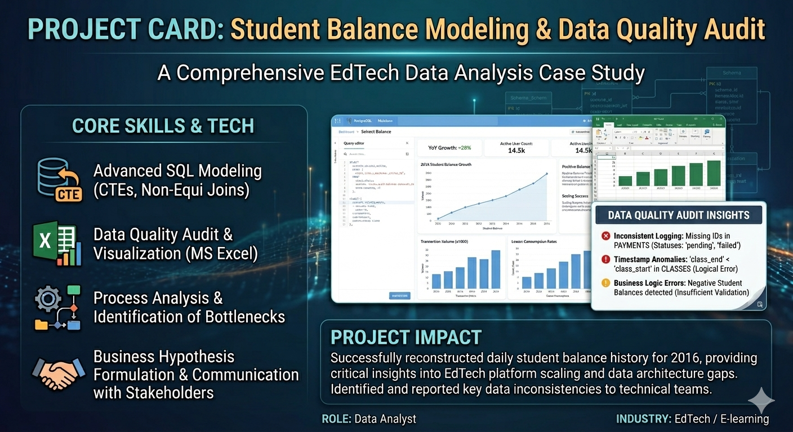

# Modeling Student Balance Dynamics via SQL

## Project Overview

This project focuses on modeling the daily balance dynamics for students of an EdTech platform. By reconstructing the history of payments and lesson consumption, the project aims to evaluate business growth and identify critical inconsistencies in the underlying data architecture.

## Data 
The analysis is based on 4 relational datasets (Data Marts):
- **classes**: Lesson records (user_id, id_class, start/end timestamps, status, teacher_id).
- **payments**: Transactional data (user_id, transaction_id, operation type, status, amount, lesson count).
- **students**: User demographics (user_id, gender, geo-cluster, country, region, email domain).
- **teachers**: Instructor profiles (id_teacher, age, city, department, language proficiency level).

## Mission Objectives 
The project was structured into three main phases:
### 1. Data Mart Construction (SQL)
- Develop foundational queries to track first payments and calendar activity.
- Aggregate daily transactions and lesson write-offs.
### 2. Balance Reconstruction
- Utilize Common Table Expressions (CTEs) to join financial and educational data.
- Model the daily balance for every student from their first transaction onwards.
### 3. Data Quality Audit & Visualization (MS Excel)
- Identify logical bottlenecks and data entry errors in the database.
- Visualize growth trends and draw conclusions regarding platform scaling.

## Implementation Details 
The tasks were performed using **PostgreSQL** (Metabase environment). The logic was implemented through a multi-stage SQL script using the following CTE structure:
- **first_payments**: Identifies the acquisition date for each user.
- **all_dates**: Generates a continuous time-series calendar for 2016.
- **payments_by_dates**: Aggregates successful financial transactions.
- **classes_by_dates**: Calculates negative balance adjustments from completed lessons.
- **all_dates_by_user**: Maps the user lifecycle to the global calendar.

## Deliverables 
### Key Findings & Methodology

### 1. SQL Modeling Logic
The core of the project is a complex join of transactional and behavioral data. By using non-equi joins, I successfully created a daily snapshot of the platform's liability (unused lessons) to students.

### 2. Data Quality Audit (Critical Insights)
During the modeling phase, several high-priority data integrity issues were identified and reported:
- **Inconsistent Logging**: Missing IDs in the `payments` table for records with identical statuses.
- **Timestamp Anomalies**: Records in the `classes` table where end times preceded start times.
- **Business Logic Errors**: Detection of negative student balances, suggesting a lack of automated "insufficient funds" validation.

### 3. Visualization & Business Growth
Analysis of the 2016 data confirms a significant upward trend in:
- Total lessons held on student balances.
- Monthly transaction volume.
- Daily completed lesson rates.
**Conclusion**: The platform experienced robust organic growth throughout the year, successfully scaling its user base and operational activity.

## 📌 Personal context note
This project was done as part of the Data Analytics cource at SkyPro (Moscow), class of 2022-2023.
Feel free to reach out or connect with me on [LinkedIn](https://www.linkedin.com/in/shashkov-aleksei/)!